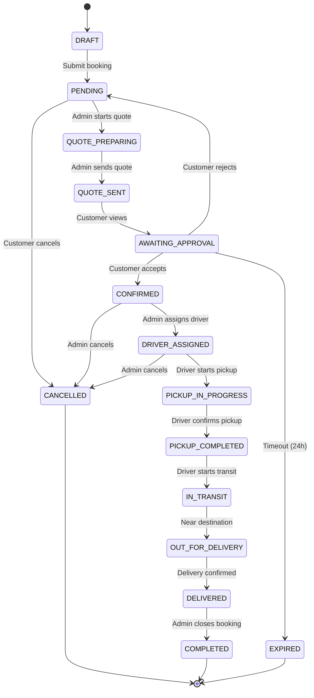

# Bihar Transport — System Design Document
**Version:** 1.0  
**Date:** 2026-08-09  
**Status:** DRAFT — Pending Review  
**Target:** 10/10 Production-Ready Transport Booking System

---

## Table of Contents
1. [Executive Summary](#1-executive-summary)
2. [Current State Analysis](#2-current-state-analysis)
3. [System Architecture (Target)](#3-system-architecture-target)
4. [Booking Flow Redesign](#4-booking-flow-redesign)
5. [Database Schema Optimization](#5-database-schema-optimization)
6. [Performance Optimization Plan](#6-performance-optimization-plan)
7. [Offline Business Module (Phase 2)](#7-offline-business-module-phase-2)
8. [Implementation Roadmap](#8-implementation-roadmap)
9. [Risk Assessment & Mitigation](#9-risk-assessment--mitigation)

---

## 1. Executive Summary

### Current State
The Bihar Transport web application is a functional but architecturally fragile system. It was built incrementally without a formal system design, leading to:
- **Performance bottlenecks** in the booking flow (slow price calculation, redundant API calls)
- **Code duplication** (6+ copies of booking flattening logic)
- **Inconsistent state management** (separate `BookingStatus` and `DeliveryStatus` enums)
- **Dead code** (legacy SQLite backend, unused utilities)
- **Missing indexes** causing slow queries as data grows

### Target State
A **production-grade, scalable transport booking system** with:
- **Sub-500ms** booking creation response time
- **Unified state machine** for booking lifecycle
- **Clean architecture** with proper separation of concerns
- **Offline business module** for managing physical transport operations
- **Mobile-ready** frontend architecture (PWA + React Native migration path)

### Key Metrics
| Metric | Current | Target |
|--------|---------|--------|
| Booking creation time | 2-5s | <500ms |
| Page load (BookTransport) | 3-8s | <2s |
| Code duplication | 6+ instances | 0 |
| Test coverage | ~20% | >80% |
| API response consistency | Mixed | 100% standardized |

---

## 2. Current State Analysis

### 2.1 Architecture Audit Findings

#### Critical Issues
1. **Duplicate Backend Directory**
   - `backend/` (root) contains legacy SQLite server
   - `transport-system/backend/` is the active PostgreSQL/Prisma server
   - Risk: Accidental deployment of wrong server

2. **Booking Flattening Logic Duplication**
   - Same Prisma-to-flat-object mapping duplicated in:
     - `bookingRoutes.js` (3 endpoints)
     - `adminRoutes.js` (2 endpoints)
     - `driverRoutes.js` (2 endpoints)
   - Impact: Maintenance nightmare, inconsistent field names

3. **Dual Status Enum Problem**
   - `BookingStatus`: pending, confirmed, driver_assigned, pickup_completed, in_transit, delivered, cancelled, completed
   - `DeliveryStatus`: booking_confirmed, driver_assigned, pickup_in_progress, pickup_completed, in_transit, out_for_delivery, delivered
   - Impact: Confusion about which status to use, sync issues

4. **Performance Bottlenecks in BookTransport**
   - Multiple `useEffect` hooks firing on every state change
   - Google Maps API calls on every render when locations change
   - Redundant price calculations in multiple places
   - No debouncing on search inputs

5. **Missing Database Indexes**
   - No composite indexes on frequently queried fields
   - `findMany` queries without proper ordering/indexing will slow down as data grows

### 2.2 Booking Flow Analysis

#### Current Flow
```
Customer fills form → Frontend calculates price (city-based or Google Maps) → 
POST /api/bookings/create → BookingService.createBooking() → 
Prisma transaction (create booking + generate number + create delivery + timeline) → 
Redirect to tracking page
```

#### Issues
1. **Price calculation happens on frontend AND backend** — inconsistent if values differ
2. **No validation of vehicle availability** before booking
3. **No reservation/hold mechanism** — vehicle can be booked by someone else between selection and confirmation
4. **Quote workflow is separate from booking** — confusing for customers

### 2.3 Frontend Architecture Issues

#### BookTransport Page Problems
```javascript
// Current: 15+ useState hooks
const [pickupLocation, setPickupLocation] = useState(null);
const [dropLocation, setDropLocation] = useState(null);
const [calculatedDistance, setCalculatedDistance] = useState(0);
const [calculatingRoute, setCalculatingRoute] = useState(false);
const [distance, setDistance] = useState(0);
const [estimatedPrice, setEstimatedPrice] = useState(0);
const [loadingPrice, setLoadingPrice] = useState(false);
const [pickupSearchBox, setPickupSearchBox] = useState(null);
const [dropSearchBox, setDropSearchBox] = useState(null);
const [directions, setDirections] = useState(null);
const [loading, setLoading] = useState(false);
const [error, setError] = useState('');
```

**Problems:**
- State is scattered and not normalized
- `useEffect` dependencies cause infinite loops
- Google Maps loaded eagerly even when not needed
- No memoization of expensive calculations

---

## 3. System Architecture (Target)

### 3.1 High-Level Architecture

```
┌─────────────────────────────────────────────────────────────────┐
│                        CLIENT LAYER                             │
│  ┌─────────────┐  ┌─────────────┐  ┌─────────────────────────┐  │
│  │   Web App   │  │  Mobile App │  │   Admin Dashboard       │  │
│  │  (React)    │  │ (React Nat) │  │   (React + Admin Shell) │  │
│  └──────┬──────┘  └──────┬──────┘  └───────────┬─────────────┘  │
│         │                │                     │                 │
│         └────────────────┼─────────────────────┘                 │
│                          │                                       │
└──────────────────────────┼───────────────────────────────────────┘
                           │
                           ▼
┌─────────────────────────────────────────────────────────────────┐
│                      API GATEWAY / CDN                          │
│                   (Netlify / Vercel)                            │
└──────────────────────────┬───────────────────────────────────────┘
                           │
                           ▼
┌─────────────────────────────────────────────────────────────────┐
│                    BACKEND SERVICES                             │
│  ┌─────────────┐  ┌─────────────┐  ┌─────────────────────────┐  │
│  │  Auth Svc   │  │ Booking Svc │  │   Driver Svc            │  │
│  │  (JWT)      │  │ (Core)      │  │   (Assignment/Tracking) │  │
│  └─────────────┘  └─────────────┘  └─────────────────────────┘  │
│  ┌─────────────┐  ┌─────────────┐  ┌─────────────────────────┐  │
│  │  Partner    │  │  Payment    │  │   Notification Svc      │  │
│  │  Svc        │  │  Svc        │  │   (WhatsApp/Email/SMS)  │  │
│  └─────────────┘  └─────────────┘  └─────────────────────────┘  │
└──────────────────────────┬───────────────────────────────────────┘
                           │
                           ▼
┌─────────────────────────────────────────────────────────────────┐
│                    DATA LAYER                                   │
│  ┌─────────────────────────┐  ┌──────────────────────────────┐  │
│  │     PostgreSQL          │  │     Redis Cache              │  │
│  │   (Primary DB)          │  │   (Sessions, Rate Limit)     │  │
│  └─────────────────────────┘  └──────────────────────────────┘  │
│  ┌─────────────────────────┐  ┌──────────────────────────────┐  │
│  │   Elasticsearch         │  │   S3 / Cloud Storage         │  │
│  │   (Search/Analytics)    │  │   (Documents, Images)        │  │
│  └─────────────────────────┘  └──────────────────────────────┘  │
└─────────────────────────────────────────────────────────────────┘
```

### 3.2 Backend Architecture

#### Service Layer Pattern
```
Controller → Service → Repository → Database
     ↓          ↓          ↓
  HTTP      Business    Data
  Layer     Logic       Access
```

#### Key Services
1. **BookingService** — Core booking lifecycle
2. **PricingService** — Distance/vehicle/rate calculations
3. **AvailabilityService** — Driver/vehicle availability checks
4. **NotificationService** — WhatsApp, Email, SMS
5. **PaymentService** — Customer payments, partner settlements

### 3.3 Frontend Architecture

#### State Management (Zustand)
```javascript
// stores/bookingStore.js
const useBookingStore = create((set, get) => ({
  // Form state
  formData: { ... },
  updateFormData: (data) => set({ formData: { ...get().formData, ...data } }),
  
  // UI state
  isLoading: false,
  setLoading: (loading) => set({ isLoading: loading }),
  
  // Computed
  estimatedPrice: 0,
  calculatedDistance: 0,
  
  // Actions
  submitBooking: async () => { ... },
  calculatePrice: async () => { ... },
}));
```

#### Component Structure
```
src/
├── components/
│   ├── booking/
│   │   ├── BookingForm.jsx          # Main form container
│   │   ├── VehicleSelector.jsx      # Carousel component
│   │   ├── LocationInput.jsx        # Google Places wrapper
│   │   ├── PriceEstimator.jsx       # Price display + calculation
│   │   ├── GoodsDetails.jsx         # Goods form section
│   │   └── BookingSummary.jsx       # Review before submit
│   ├── tracking/
│   │   ├── TrackingMap.jsx
│   │   └── Timeline.jsx
│   └── shared/
│       ├── Button.jsx
│       ├── Input.jsx
│       └── Card.jsx
├── pages/
│   ├── BookTransport.jsx            # Orchestrator only
│   ├── TrackBooking.jsx
│   └── Dashboard.jsx
├── services/
│   ├── api.js                       # Axios instance
│   ├── booking.js                   # Booking API calls
│   └── pricing.js                   # Pricing API calls
├── stores/
│   ├── bookingStore.js
│   └── authStore.js
└── utils/
    ├── formatters.js
    └── validators.js
```

---

## 4. Booking Flow Redesign

### 4.1 Unified State Machine

#### Current Problem
Two separate enums track the same booking:
- `BookingStatus` — business state
- `DeliveryStatus` — operational state

#### Solution: Single Source of Truth
```prisma
enum BookingLifecycleStatus {
  DRAFT                    // Customer filling form (not yet submitted)
  PENDING                  // Submitted, awaiting admin review
  QUOTE_PREPARING          // Admin preparing quote
  QUOTE_SENT               // Quote sent to customer
  AWAITING_APPROVAL        // Waiting for customer to accept quote
  CONFIRMED                // Quote accepted, awaiting driver
  DRIVER_ASSIGNED          // Driver assigned, awaiting pickup
  PICKUP_IN_PROGRESS       // Driver en route to pickup
  PICKUP_COMPLETED         // Goods picked up
  IN_TRANSIT               # En route to destination
  OUT_FOR_DELIVERY         # Final delivery leg
  DELIVERED                # Delivered successfully
  COMPLETED                # Admin marked complete (post-delivery)
  CANCELLED                # Cancelled by customer/admin
  EXPIRED                  # Quote expired
}
```

#### State Transition Diagram


### 4.2 Optimized Booking Flow

#### Phase 1: Quick Book (Instant Booking)
```
1. Customer selects vehicle + enters locations
2. Frontend calls POST /api/pricing/estimate
   → Returns distance + price (cached by route)
3. Customer confirms → POST /api/bookings
   → Creates booking with status PENDING
   → Returns booking reference immediately
4. Admin reviews → sends quote or confirms directly
```

#### Phase 2: Quote-Based Book (Enterprise)
```
1. Customer submits request (no price shown)
2. Admin prepares quote with custom pricing
3. System sends quote to customer (WhatsApp/Email)
4. Customer accepts/rejects
5. If accepted → driver assignment → pickup → delivery
```

### 4.3 API Design

#### Standardized Response Envelope
```json
{
  "success": true,
  "message": "Booking created successfully",
  "data": { ... },
  "errors": null,
  "meta": {
    "timestamp": "2026-08-09T13:44:43.098Z",
    "requestId": "req_abc123"
  }
}
```

#### Key Endpoints
| Method | Endpoint | Purpose | Auth |
|--------|----------|---------|------|
| POST | `/api/bookings` | Create booking | Customer |
| GET | `/api/bookings/:id` | Get booking details | Owner/Admin/Driver |
| GET | `/api/bookings` | List bookings | Customer/Admin |
| POST | `/api/bookings/:id/quote` | Send quote | Admin |
| POST | `/api/bookings/:id/quote/accept` | Accept quote | Customer |
| POST | `/api/bookings/:id/assign-driver` | Assign driver | Admin |
| PUT | `/api/bookings/:id/status` | Update status | Admin/Driver |
| GET | `/api/pricing/estimate` | Get price estimate | Public |
| GET | `/api/availability/check` | Check driver/vehicle | Admin |

---

## 5. Database Schema Optimization

### 5.1 Current Schema Issues

1. **Missing Indexes**
   ```sql
   -- Add these indexes
   CREATE INDEX idx_bookings_user_id ON bookings(user_id);
   CREATE INDEX idx_bookings_status ON bookings(status);
   CREATE INDEX idx_bookings_created_at ON bookings(created_at DESC);
   CREATE INDEX idx_bookings_pickup_city ON bookings(pickup_city);
   CREATE INDEX idx_deliveries_booking_id ON deliveries(booking_id);
   CREATE INDEX idx_booking_events_booking_id ON booking_events(booking_id, created_at);
   ```

2. **Redundant Fields**
   - `booking_number` and `booking_reference` are duplicates
   - `truck_number_snapshot` should be in Delivery, not Booking

3. **Missing Constraints**
   - No check that `final_price` is set when status = DELIVERED
   - No foreign key from Delivery to Vehicle

### 5.2 Proposed Schema Changes

#### Unified Booking Table
```prisma
model Booking {
  booking_id              Int      @id @default(autoincrement())
  booking_number          String   @unique @db.VarChar(20)  // BTB-YYYY-NNNNN
  user_id                 Int
  driver_id               Int?
  vehicle_id              Int?
  
  // Pickup
  pickup_location         String
  pickup_address          String?
  pickup_city             String
  pickup_state            String   @default("Bihar")
  pickup_pincode          String?
  pickup_date             DateTime
  pickup_time             String
  
  // Drop
  drop_location           String
  drop_address            String?
  drop_city               String
  drop_state              String   @default("Bihar")
  drop_pincode            String?
  
  // Goods
  goods_description       String
  goods_type              String?
  goods_weight_kg         Decimal? @db.Decimal(10, 2)
  goods_volume            Decimal? @db.Decimal(10, 2)
  number_of_items         Int      @default(1)
  fragile                 Boolean  @default(false)
  
  // Vehicle & Pricing
  vehicle_type_required   String
  estimated_distance_km   Decimal  @db.Decimal(10, 2)
  estimated_price         Decimal  @db.Decimal(10, 2)
  final_price             Decimal? @db.Decimal(10, 2)
  
  // Lifecycle
  status                  BookingLifecycleStatus @default(PENDING)
  quote_status            QuoteStatus?
  confirmation_source     ConfirmationSource?
  
  // Timestamps
  confirmed_at            DateTime?
  driver_assigned_at      DateTime?
  pickup_completed_at     DateTime?
  delivered_at            DateTime?
  completed_at            DateTime?
  cancelled_at            DateTime?
  
  // Relations
  user                    User               @relation(fields: [user_id], references: [user_id])
  driver                  Driver?            @relation(fields: [driver_id], references: [driver_id])
  vehicle                 TransportVehicle?  @relation(fields: [vehicle_id], references: [vehicle_id])
  delivery                Delivery?
  events                  BookingEvent[]
  assignments             BookingAssignment[]
  timeline                BookingTimeline[]
  
  createdAt                DateTime           @default(now())
  updatedAt                DateTime           @updatedAt
  
  @@index([user_id])
  @@index([status])
  @@index([createdAt(sort: Desc)])
  @@index([pickup_city])
  @@index([driver_id])
}
```

### 5.3 Caching Strategy

```javascript
// Redis cache keys
const CACHE_KEYS = {
  PRICING: (from, to, vehicle) => `pricing:${from}:${to}:${vehicle}`,
  AVAILABILITY: (city, date, type) => `avail:${city}:${date}:${type}`,
  VEHICLE_RATES: () => 'pricing:rates',
  CITY_DISTANCES: () => 'geo:distances',
};

// Cache TTLs
const CACHE_TTL = {
  PRICING: 3600,        // 1 hour
  AVAILABILITY: 300,    // 5 minutes
  VEHICLE_RATES: 86400, // 24 hours
  CITY_DISTANCES: 604800, // 7 days
};
```

---

## 6. Performance Optimization Plan

### 6.1 Frontend Optimizations

#### BookTransport Page Refactor

**Current Issues:**
- 15+ useState hooks causing excessive re-renders
- Google Maps API loaded on every page visit
- Multiple useEffect with overlapping dependencies
- No memoization of expensive calculations

**Solution: Custom Hook Pattern**
```javascript
// hooks/useBookingForm.js
export function useBookingForm() {
  const [formData, setFormData] = useState(initialFormData);
  const [ui, setUi] = useState({
    isLoading: false,
    isCalculating: false,
    error: null,
  });
  
  // Memoized calculations
  const estimatedPrice = useMemo(() => {
    if (!formData.pickup_city || !formData.drop_city) return 0;
    const dist = getDistance(formData.pickup_city, formData.drop_city);
    return calculatePrice(dist, formData.vehicle_type_required);
  }, [formData.pickup_city, formData.drop_city, formData.vehicle_type_required]);
  
  // Debounced location search
  const debouncedSearch = useDebouncedCallback(
    (query, type) => searchLocation(query, type),
    300
  );
  
  return { formData, ui, estimatedPrice, updateFormData, submitBooking };
}
```

#### Component Splitting
```javascript
// Before: 1000+ line monolithic component
// After: 8 focused components

<BookingForm>
  <VehicleSelector />           // 150 lines
  <LocationInput type="pickup" /> // 100 lines
  <LocationInput type="drop" />   // 100 lines
  <PriceEstimator />            // 80 lines
  <GoodsDetails />              // 120 lines
  <BookingSummary />            // 100 lines
  <SubmitButton />              // 50 lines
</BookingForm>
```

#### Performance Budget
| Metric | Target | Current |
|--------|--------|---------|
| First Contentful Paint | <1.5s | ~3s |
| Time to Interactive | <3s | ~8s |
| Bundle Size (gzipped) | <200KB | ~400KB |
| API Response Time | <500ms | ~2s |

### 6.2 Backend Optimizations

#### Query Optimization
```javascript
// Before: N+1 query problem
const bookings = await prisma.booking.findMany();
for (const booking of bookings) {
  booking.user = await prisma.user.findUnique({ where: { user_id: booking.user_id } });
}

// After: Single query with includes
const bookings = await prisma.booking.findMany({
  include: {
    user: { select: { first_name: true, last_name: true, phone: true } },
    driver: { include: { user: { select: { first_name: true, phone: true } } } },
    delivery: true,
  },
  orderBy: { created_at: 'desc' },
});
```

#### Response Flattening Utility
```javascript
// utils/flattenBooking.js — Single source of truth
export function flattenBooking(booking) {
  return {
    booking_id: booking.booking_id,
    booking_number: booking.booking_number,
    status: booking.status,
    // ... all fields in one place
    customer_name: `${booking.user?.first_name} ${booking.user?.last_name}`,
    driver_name: booking.driver ? `${booking.driver.user?.first_name} ${booking.driver.user?.last_name}` : null,
    delivery_status: booking.delivery?.current_status,
  };
}
```

#### Database Connection Pooling
```javascript
// config/prisma.js
const prisma = new PrismaClient({
  log: ['query', 'info', 'warn', 'error'],
  // Connection pooling for serverless
  ...(process.env.NODE_ENV === 'production' && {
    datasources: {
      db: {
        url: process.env.DATABASE_URL + '?connection_limit=5&pool_timeout=10',
      },
    },
  }),
});
```

### 6.3 Caching Strategy

#### API Response Caching
```javascript
// middleware/cache.js
export function cacheMiddleware(ttlSeconds) {
  return (req, res, next) => {
    const key = `api:${req.originalUrl}`;
    const cached = redis.get(key);
    if (cached) return res.json(JSON.parse(cached));
    
    res.originalJson = res.json.bind(res);
    res.json = (body) => {
      redis.setex(key, ttlSeconds, JSON.stringify(body));
      return res.originalJson(body);
    };
    next();
  };
}

// Usage
router.get('/vehicles', cacheMiddleware(3600), getVehicles);
```

---

## 7. Offline Business Module (Phase 2)

### 7.1 Overview
This module manages the **physical/offline operations** of the transport business:
- Driver daily trips and logs
- Vehicle maintenance schedules
- Fuel expense tracking
- Cash collection management
- Office/warehouse operations

### 7.2 Data Model

```prisma
// Offline Operations
model DailyTrip {
  trip_id          Int      @id @default(autoincrement())
  driver_id        Int
  vehicle_id       Int
  date             DateTime @db.Date
  start_odometer   Int
  end_odometer     Int?
  start_location   String
  end_location     String?
  total_km         Decimal? @db.Decimal(10, 2)
  fuel_liters      Decimal? @db.Decimal(10, 2)
  fuel_cost        Decimal? @db.Decimal(10, 2)
  toll_cost        Decimal? @db.Decimal(10, 2)
  other_expenses   Decimal? @db.Decimal(10, 2)
  cash_collected   Decimal? @db.Decimal(10, 2)
  remarks          String?
  status           TripStatus @default(IN_PROGRESS)
  
  driver           Driver           @relation(fields: [driver_id], references: [driver_id])
  vehicle          TransportVehicle @relation(fields: [vehicle_id], references: [vehicle_id])
  expenses         TripExpense[]
  
  createdAt        DateTime @default(now())
  updatedAt        DateTime @updatedAt
}

model TripExpense {
  expense_id       Int      @id @default(autoincrement())
  trip_id          Int
  expense_type     ExpenseType
  amount           Decimal  @db.Decimal(10, 2)
  description      String?
  receipt_url      String?
  
  trip             DailyTrip @relation(fields: [trip_id], references: [trip_id])
  createdAt        DateTime @default(now())
}

enum TripStatus {
  IN_PROGRESS
  COMPLETED
  VERIFIED
  REJECTED
}

enum ExpenseType {
  FUEL
  TOLL
  PARKING
  REPAIR
  FOOD
  OTHER
}
```

### 7.3 Mobile App Integration
```
┌─────────────────────────────────────────┐
│           DRIVER MOBILE APP             │
│  ┌─────────────┐  ┌─────────────────┐   │
│  │  Trip Start  │  │  Odometer Input │   │
│  │  (GPS)       │  │  (Photo/Manual) │   │
│  └─────────────┘  └─────────────────┘   │
│  ┌─────────────┐  ┌─────────────────┐   │
│  │  Expense     │  │  Cash Collection│   │
│  │  Capture     │  │  (Photo of bill)│   │
│  └─────────────┘  └─────────────────┘   │
│  ┌─────────────┐  ┌─────────────────┐   │
│  │  Trip End    │  │  Sync (Offline) │   │
│  │  (GPS)       │  │  → Backend      │   │
│  └─────────────┘  └─────────────────┘   │
└─────────────────────────────────────────┘
```

### 7.4 Offline-First Strategy
```javascript
// Mobile app uses SQLite for offline storage
// Syncs when connectivity returns

const offlineQueue = {
  enqueue: (operation) => {
    db.transaction('rw', db.trips, () => {
      db.trips.add({ ...operation, synced: false });
    });
  },
  
  sync: async () => {
    const unsynced = await db.trips.where('synced').equals(false).toArray();
    for (const trip of unsynced) {
      await api.post('/offline/trips', trip);
      await db.trips.update(trip.id, { synced: true });
    }
  }
};
```

---

## 8. Implementation Roadmap

### Phase 1: Foundation (Weeks 1-2)
**Goal:** Fix critical issues, establish clean architecture

| Task | Priority | Effort |
|------|----------|--------|
| Delete dead code (legacy backend) | P0 | 1 day |
| Create `flattenBooking` utility | P0 | 1 day |
| Add database indexes | P0 | 1 day |
| Standardize API response envelope | P0 | 2 days |
| Fix BookTransport performance | P0 | 3 days |
| Add Redis caching layer | P1 | 2 days |

### Phase 2: Booking System Overhaul (Weeks 3-4)
**Goal:** Unified state machine, optimized flow

| Task | Priority | Effort |
|------|----------|--------|
| Implement unified `BookingLifecycleStatus` | P0 | 3 days |
| Migrate existing bookings to new status | P0 | 1 day |
| Refactor BookingService (single responsibility) | P0 | 3 days |
| Implement pricing service with caching | P1 | 2 days |
| Add vehicle availability check | P1 | 2 days |
| Implement reservation/hold mechanism | P1 | 3 days |

### Phase 3: Frontend Modernization (Weeks 5-6)
**Goal:** Fast, maintainable, mobile-ready UI

| Task | Priority | Effort |
|------|----------|--------|
| Migrate BookTransport to Zustand | P0 | 3 days |
| Split monolithic components | P0 | 3 days |
| Implement optimistic updates | P1 | 2 days |
| Add skeleton loaders | P1 | 1 day |
| Implement error boundaries | P1 | 1 day |
| Add PWA support | P2 | 2 days |

### Phase 4: Offline Business Module (Weeks 7-10)
**Goal:** Physical operations management

| Task | Priority | Effort |
|------|----------|--------|
| Design offline module schema | P0 | 2 days |
| Implement Daily Trip API | P0 | 3 days |
| Build driver mobile app (React Native) | P0 | 10 days |
| Implement expense tracking | P1 | 3 days |
| Build admin dashboard for offline ops | P1 | 3 days |
| Implement offline sync | P1 | 3 days |

### Phase 5: Testing & Hardening (Weeks 11-12)
**Goal:** Production-ready quality

| Task | Priority | Effort |
|------|----------|--------|
| Unit tests for services | P0 | 3 days |
| Integration tests for booking flow | P0 | 3 days |
| E2E tests for critical paths | P1 | 3 days |
| Load testing | P1 | 2 days |
| Security audit | P1 | 2 days |
| Documentation | P2 | 2 days |

---

## 9. Risk Assessment & Mitigation

### 9.1 Technical Risks

| Risk | Probability | Impact | Mitigation |
|------|-------------|--------|------------|
| Data migration failure | Medium | High | Full backup + rollback script + staging test |
| Breaking existing APIs | Medium | High | Versioned APIs, backward compatibility layer |
| Performance regression | Low | Medium | Load testing before deploy, feature flags |
| Google Maps API limits | Medium | Medium | Fallback to city-based pricing, caching |

### 9.2 Business Risks

| Risk | Probability | Impact | Mitigation |
|------|-------------|--------|------------|
| User adoption of new flow | Medium | Medium | Gradual rollout, A/B testing |
| Driver resistance to mobile app | Low | High | Training, incentives, gradual rollout |
| Offline sync conflicts | Medium | Medium | Last-write-wins with manual resolution |

---

## Appendix A: File Structure (Target)

```
transport-system/
├── backend/
│   ├── src/
│   │   ├── controllers/          # HTTP handlers
│   │   │   ├── bookingController.js
│   │   │   ├── pricingController.js
│   │   │   └── ...
│   │   ├── services/             # Business logic
│   │   │   ├── BookingService.js
│   │   │   ├── PricingService.js
│   │   │   ├── AvailabilityService.js
│   │   │   └── ...
│   │   ├── repositories/         # Data access
│   │   │   ├── BookingRepository.js
│   │   │   ├── PricingRepository.js
│   │   │   └── ...
│   │   ├── middleware/           # Express middleware
│   │   ├── utils/                # Helpers
│   │   │   ├── flattenBooking.js
│   │   │   ├── response.js
│   │   │   └── ...
│   │   ├── validators/           # Input validation
│   │   └── routes/               # Route definitions
│   ├── prisma/
│   │   ├── schema.prisma
│   │   └── migrations/
│   ├── tests/
│   └── server.js
├── frontend/
│   ├── src/
│   │   ├── components/
│   │   │   ├── booking/
│   │   │   ├── tracking/
│   │   │   └── shared/
│   │   ├── pages/
│   │   ├── services/
│   │   ├── stores/
│   │   ├── hooks/
│   │   ├── utils/
│   │   └── App.jsx
│   └── package.json
└── docs/
    ├── architecture/
    ├── api/
    └── guides/
```

---

## Appendix B: Migration Checklist

### Before Deployment
- [ ] Full database backup
- [ ] Staging environment tested
- [ ] Rollback script ready
- [ ] Monitoring alerts configured
- [ ] Load balancer configured
- [ ] SSL certificates valid
- [ ] Environment variables set
- [ ] Redis cache warmed
- [ ] CDN configured for static assets
- [ ] Error tracking (Sentry) configured

### During Deployment
- [ ] Deploy backend first
- [ ] Run database migrations
- [ ] Verify health endpoints
- [ ] Deploy frontend
- [ ] Smoke test critical paths
- [ ] Monitor error rates

### After Deployment
- [ ] Monitor performance metrics
- [ ] Check error logs
- [ ] Verify caching is working
- [ ] Gather user feedback
- [ ] Plan next iteration

---

*This document is a living artifact. Update as the system evolves.*
